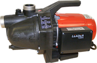
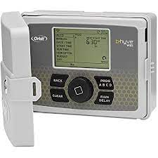
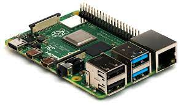
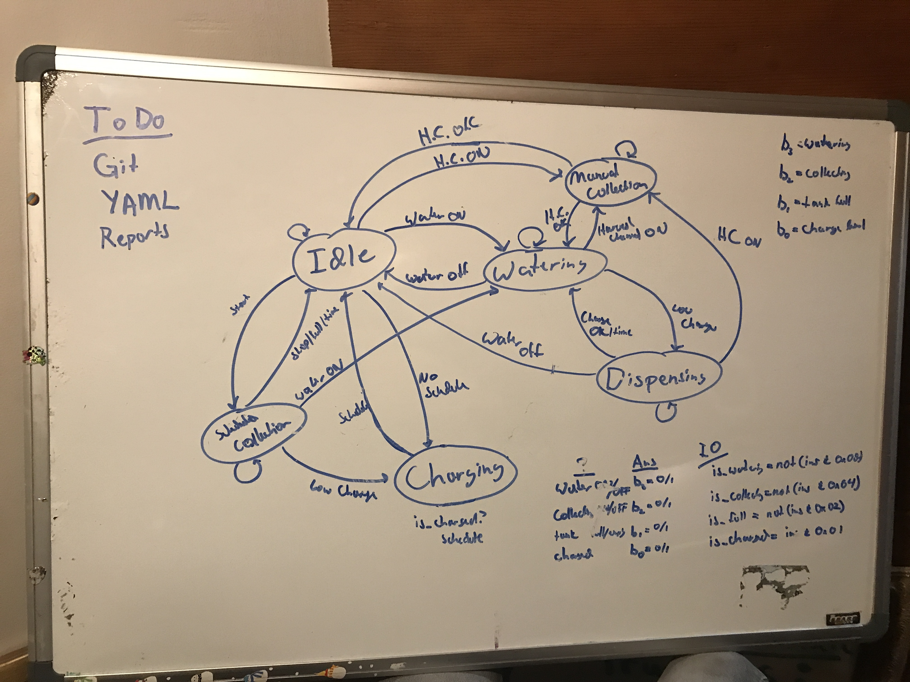

# harvestingSystem

This project empowers people to harvest trickles of water into storage containers for use with a distribution system (e.g. jet pump).  Typical use would be to water garden plants and potentially offset water usage in a home.

  

  

# Problem

Water accumulates slowly in a shallow well, small pond, or other temporary storage facility (generally called "shallow well").  The shallow well is used with a jet pump (with proper filtering), irrigation timer, and irrigation system to water plants.  However, the well capacity is limited, so much so that daily watering depletes the supply.  Massively repeating daily irrigation is unrealistic due to guesswork and motor wear.

However, more water passes through the storage facility than is used on any given day.  There is an opportunity to capture this water and use it in larger batches.

# Solution

Leverage an irrigation timer, rPI, jet pump, and 55 gallon drum set (water store) to collect water periodically over a 24hr period.  Use collected water to recharge a depleted shallow well during depletion periods.  Use float sensors and rPI to measure shallow well depth, tank fullness, and control the system.  

## rPI System Software

The solution has the following architecture and states: 'idle', 'watering', 'collecting', 'dispensing', 'collectingSch', 'charging'

The solution uses the following system components: systemD, transitions, texting platform (textbelt.com), and YAML

### systemD

systemD is used to enable, monitor, and start the system as a service within the linux environment

### transitions

The system uses the transitions library to manage states, state changes, and IO changes

### text messaging

The system uses requests and the platform textbelt.com for once per day error messaging

### YAML

The system leverages YAML settings to control basic system settings.  Those settings are:
* chargeTime: the elapsed time to pass before kicking off a scheduled collection period
* dispenseTime: the maximum amount of time the system will allow the tanks to dispense collected water back into the shallow well
* tenDigit: the ten digit phone number assigned to receive error messages from the system

## Float Sensors

There are 3 float sensors used in the project: Jet Pump Override, Shallow Well Midway, and Tank Full.

### Jet Pump Override

The first float sensor is placed at the bottom of the shallow well attached slightly above the foot valve.  The pump overrides other methods for turning the pump on to ensure the pump does not lose prime when this switch is engaged.

### Shallow Well Midway

Midway down the shallow well intake, a float sensor is placed to monitor the depletion level of the shallow well.  The signal from the float value triggers a timed release of stored water from the 55 gallon drums.  Furthermore, this float valve is used to halt periodic collections from the shallow well to the tanks.

### Tank Full

A float sensor is placed into the water store to signal the collection system that the tanks are full.  This is used to bypass a scheduled collection and to stop a collection

## Electrical Integration

The system monitors the irrigation controller to prevent accidental collisions during operation.

### Float Sensors 12VDC -> 3.3V

The system monitors the Shallow Well Midway and Tank Full float sensors via optocoupler.

The Jet Pump Override is not monitored by the system due to the sensitivity of losing prime. That line is directly monitored by a relay system that controls the master valve.  In the event of low water, the relay will keep the Master Valve off for 15 minutes.

### Master 24VAC -> 3.3V

The Master Pump line is monitored via bridge rectifier and opto isolator.  The signal is used to give priority to the irrigation controller yet enable the rPI to deliver 24VAC to the Master Valve without the irrigation controller via Relay

### Collect Line -> 3.3V

The irrigation controller enables out of band water collection from the shallow well to the water store.  Using the same electrical integration method as the Master Pump line, the Collect line is similarly monitored.  This enables the rPI to initiate collection per the schedule.

# Future Work

* Potentially reconfigure the system such the the pump delivers water from the tanks and not from the well.  In a single pump design, this would leverage a SPDT valve at the intake
* Collect system data for analysis

# License

This project is provided as-is.  Use at your own risk.  Terms are governed by the selected license.
